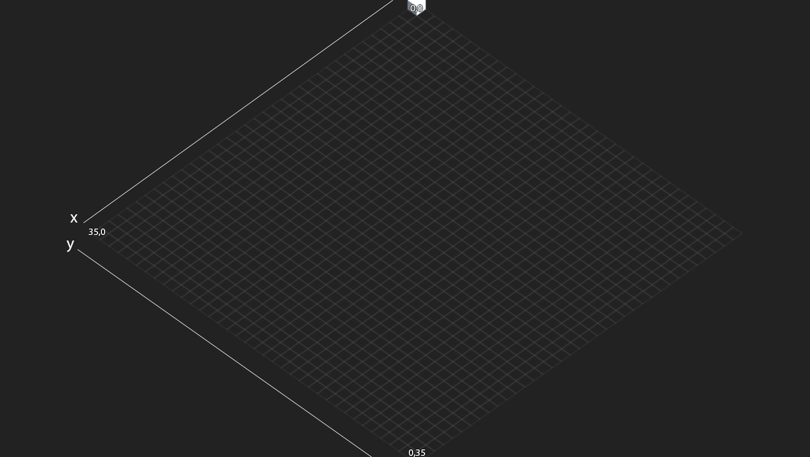

# Script
# Grid Array

> y is z.

## Building.cs
>Building Script has 3 properties.
>- size : this value is helping to calculate grid available about building size.
>- x : this value is update when you move gameobject(include Building Component)
>- z : this value is update when you move gameobject(include Building Component)