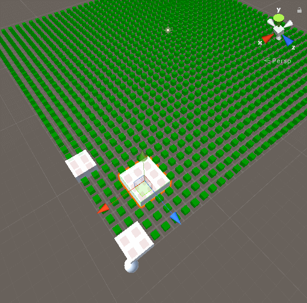

# Caution
>This script is not good to use. 
>Just see how to work this system and try to remake your own.

# Grid Available
>If there grid is can use gizmo draw there green cube. 
>If there using (about building) will be draw red cube. 

# Descrption
[**description**](./DESCRIPTION.md)